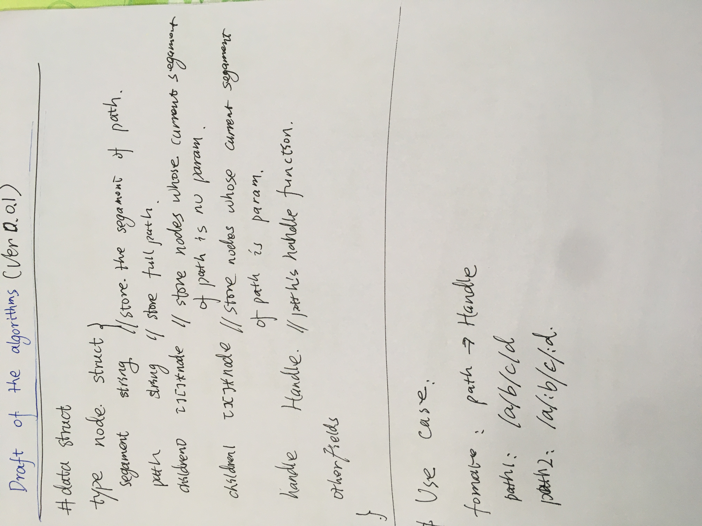
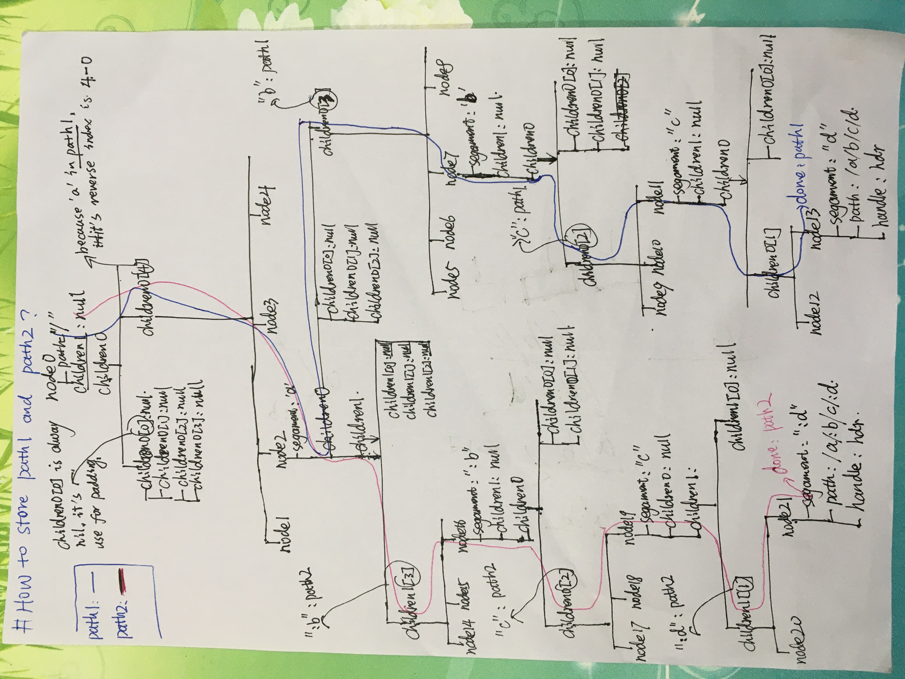

## httprouter
- Another implement of http router, compatible with the httprouter.
- The goal of this design is to make it faster perform and more easily readable than the famouse `httprouter`.

## Usage
This use cases are the copy of the [`julienschmidt/httprouter`](https://github.com/julienschmidt/httprouter#usage),cause it's compatible with `julienschmidt/httprouter`.So, you can replace 
`github.com/julienschmidt/httprouter` with `github.com/tanzy2018/httprouter`, just like the example as follow:

```go
package main

import (
    "fmt"
    "net/http"
    "log"
    // "github.com/julienschmidt/httprouter"
    "github.com/tanzy2018/httprouter"
)

func Index(w http.ResponseWriter, r *http.Request, _ httprouter.Params) {
    fmt.Fprint(w, "Welcome!\n")
}

func Hello(w http.ResponseWriter, r *http.Request, ps httprouter.Params) {
    fmt.Fprintf(w, "hello, %s!\n", ps.ByName("name"))
}

func main() {
    router := httprouter.New()
    router.GET("/", Index)
    router.GET("/hello/:name", Hello)

    log.Fatal(http.ListenAndServe(":8080", router))
}
```

## Draft of core algorithms(Ver0.0.1)
- ### `datastruct`

- ###  `algorithms`
